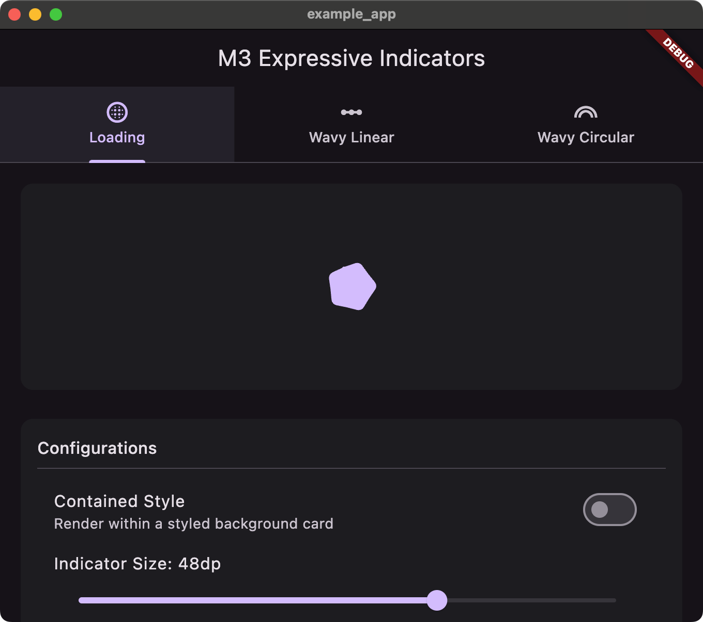
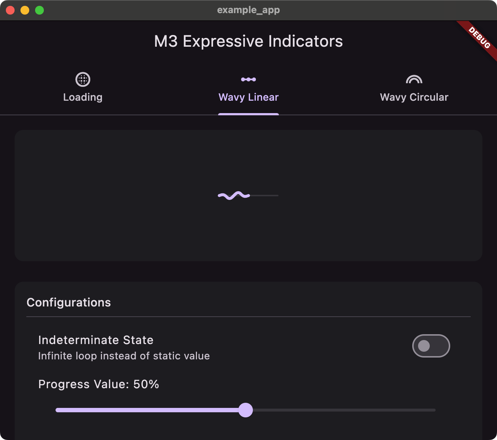
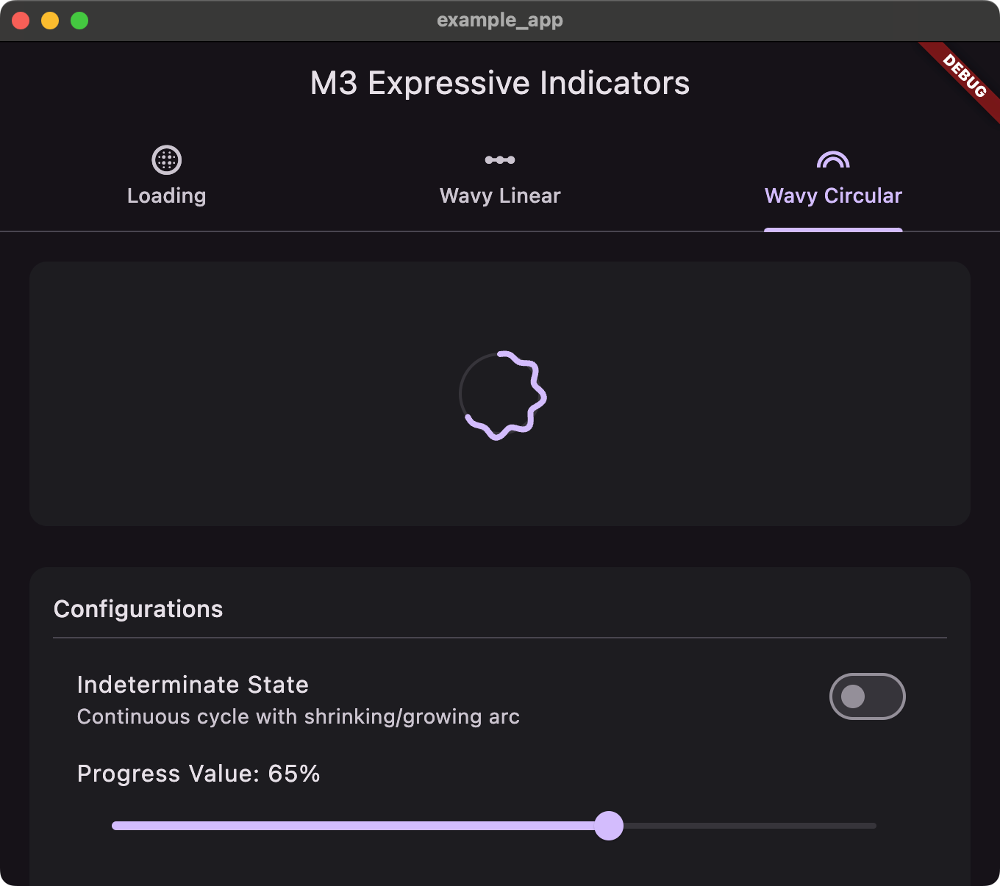

# material3_indicators

최신 **Material 3 Expressive** 가이드라인에 따른 로딩 및 프로그레스 인디케이터를 제공하는 Flutter 패키지입니다. 현재 이 가이드라인에 정의된 모션(물결 모양 프로그레스 트랙 및 도형 모핑 로더)은 Flutter 코어 SDK에 기본 구현되어 있지 않습니다. 본 패키지는 이를 매우 높은 피델리티와 성능으로 구현하여 제공합니다.

## 주요 기능

<p align="center">
  
  
  
</p>

| 컴포넌트 | 스타일 | 주요 특징 |
| :--- | :--- | :--- |
| **`ExpressiveLoadingIndicator`** | 도형 모핑 스피너 | 둥근 다각형(오각형, 태양 모양, 소프트 버스트, 쿠키 모양, 알약 모양) 간을 스프링 물리 기반으로 부드럽게 모핑하며 회전합니다. 테두리선/채우기, 컨테이너 카드 내장(Contained) 여부를 옵션으로 조절할 수 있습니다. |
| **`WavyLinearProgressIndicator`** | 물결 모양 선형 프로그레스 바 | 진행 바가 사인파(Sine wave) 형태로 흔들리며 전진합니다. 물결의 양 끝단에 경계선 감쇠(Edge Envelope) 공식을 적용하여, 활성 영역이 평평한 배경 트랙과 자연스럽게 만나도록 마감했습니다. |
| **`WavyCircularProgressIndicator`** | 극좌표 물결형 프로그레스 링 | 극좌표계를 응용하여 원형 궤적 위에서 파동을 치며 회전합니다. 마찬가지로 곡선의 끝부분이 부드럽게 감쇠하여 원형 트랙에 자연스럽게 일치합니다. |

---

## 시작하기

`pubspec.yaml` 파일에 `material3_indicators` 의존성을 추가합니다:

```yaml
dependencies:
  material3_indicators:
    path: path/to/local/material3_indicators # 또는 pub.dev 출시 후 버전 지정
```

Dart 파일에서 패키지를 임포트합니다:

```dart
import 'package:material3_indicators/material3_indicators.dart';
```

---

## 사용법

### 1. 도형 모핑 로딩 인디케이터 (Expressive Loading Indicator)

```dart
// 기본형 (배경 박스 없음)
const ExpressiveLoadingIndicator(
  size: 36.0,
);

// 배경 박스가 있는 형태 (Contained Mode)
const ExpressiveLoadingIndicator(
  contained: true,
  size: 40.0,
  containerSize: 72.0,
  morphDuration: Duration(milliseconds: 800),
);

// 순환될 커스텀 도형 목록 지정
ExpressiveLoadingIndicator(
  shapes: [
    ExpressiveShapes.pentagon(),
    ExpressiveShapes.cookie(),
  ],
);
```

### 2. 물결 모양 선형 프로그레스 바 (Wavy Linear Progress Indicator)

```dart
// Determinate 상태 (특정 진행률 표시)
WavyLinearProgressIndicator(
  value: 0.6,
  amplitude: 4.0,
  wavelength: 24.0,
  waveSpeed: 5.0,
  strokeWidth: 4.0,
);

// Indeterminate 상태 (무한 반복)
const WavyLinearProgressIndicator(
  value: null, // M3 규격의 스윕 애니메이션 자동 재생
);
```

### 3. 물결 모양 원형 프로그레스 링 (Wavy Circular Progress Indicator)

```dart
// Determinate 상태 (특정 진행률 표시)
WavyCircularProgressIndicator(
  value: 0.75,
  size: 64.0,
  amplitude: 3.0,
  frequency: 8.0, // 원 한 바퀴(360도)에 들어가는 파동 횟수
);

// Indeterminate 상태 (무한 반복)
const WavyCircularProgressIndicator(
  value: null,
);
```

---

## 추가 정보

### 커스텀 도형 (Custom Shapes)
`ExpressiveShapes` 클래스에서 제공하는 다양한 [StarBorder] 생성 헬퍼 함수를 조합하여 원하시는 순환 다각형 시퀀스를 설계할 수 있으며, 일반적인 custom `ShapeBorder` 리스트를 `ExpressiveLoadingIndicator(shapes: [...])`에 직접 주입할 수도 있습니다.

### 경계선 감쇠 수학 공식 (Edge Envelope)
물결의 파동이 진행 바의 경계선(시작 및 끝 지점)에서 급격하게 끊기지 않도록 양단에서 진폭을 점진적으로 0으로 수렴시키는 Envelope 보간을 구현했습니다. 이를 통해 파동이 트랙의 둥근 마감캡(Round Cap)과 완벽하게 수평을 이루며 매끄럽게 흐릅니다.
